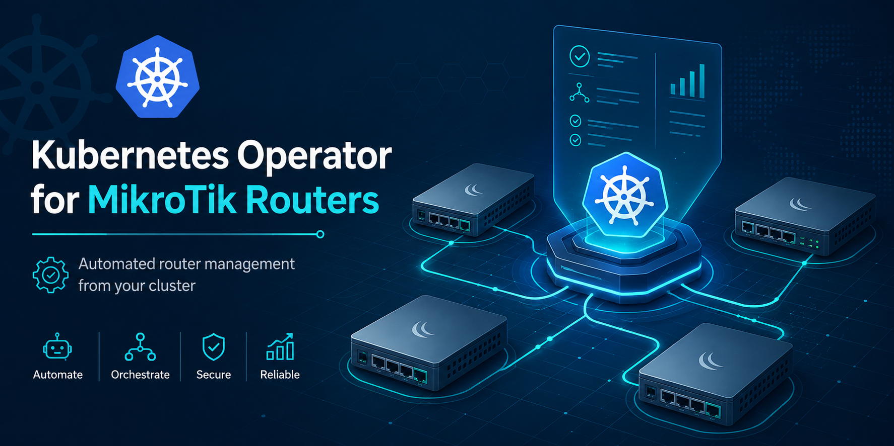
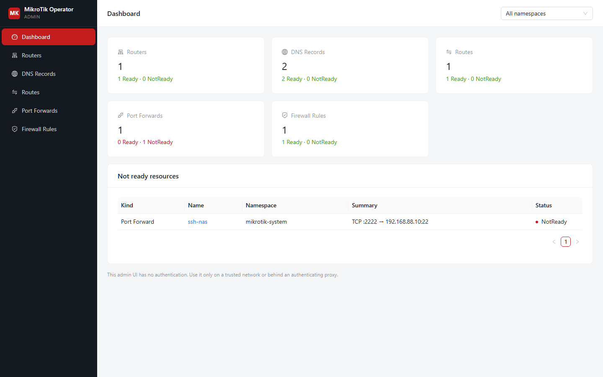
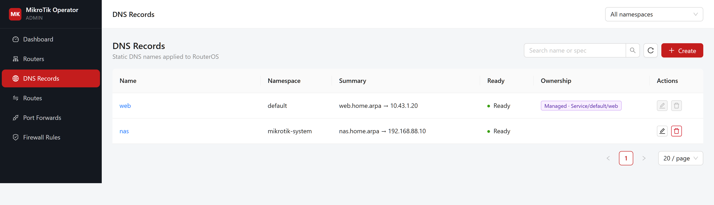
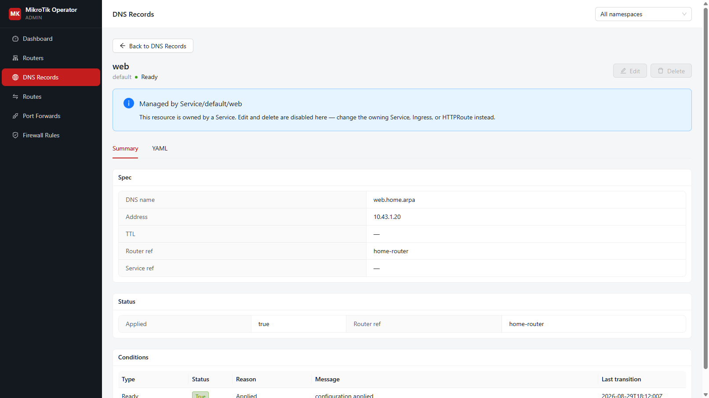

# MikroTik Kubernetes Operator

[](https://github.com/ZeljkoBenovic/mikrotik-operator/actions/workflows/ci.yml)
[](https://github.com/ZeljkoBenovic/mikrotik-operator/releases)
[](https://github.com/ZeljkoBenovic/mikrotik-operator/pkgs/container/mikrotik-operator)
[](https://github.com/johnpapa/ai-ready)



Manage MikroTik RouterOS configuration from Kubernetes. The operator supports
RouterOS v6 and v7 and is designed for local Kubernetes clusters, such as k3s,
where a MikroTik router is the network gateway.

Read the [public documentation](https://zeljkobenovic.github.io/mikrotik-operator/)
for installation, usage, reference, architecture, and
[troubleshooting](docs/troubleshooting.md).

It creates DNS records, routes, NAT port forwards, and firewall rules while
only managing configuration entries that it owns. Existing RouterOS rules are
left untouched.

## Features

- Stand-alone Go operator using controller-runtime.
- RouterOS v6 and v7 support through the RouterOS API.
- One logical `MikroTikRouter` can manage multiple router endpoints.
- Credentials loaded from Kubernetes Secrets.
- Automatic DNS records and routes for annotated Services.
- Ingress and Gateway API `HTTPRoute` support.
- `/32` routes for ClusterIP Services through all node addresses, with an
  optional single-node mode.
- Destination NAT and matching source masquerade rules for exposed Services.
- Managed forward firewall rules for port forwards.
- Custom resources for DNS records, routes, port forwards, and firewall rules.
- Idempotent reconciliation and periodic drift correction.
- Optional admin UI for listing, inspecting, and creating custom resources.

## How it works

The operator watches Kubernetes resources and reconciles the desired state to
RouterOS. Every generated RouterOS entry receives a managed comment, allowing
the operator to update or remove only its own entries.

The core resources are namespaced:

| Resource | Purpose |
| --- | --- |
| `MikroTikRouter` | Router connection, credentials, and optional endpoints |
| `MikroTikDNSRecord` | `/ip dns static` record |
| `MikroTikRoute` | `/ip route` entry |
| `MikroTikPortForward` | `dst-nat`, `src-nat`, and forward firewall rules |
| `MikroTikFirewallRule` | Custom `/ip firewall filter` entry |

`routerRef` is optional when exactly one non-deleting `MikroTikRouter` exists
in the resource namespace, or when that namespace has none and exactly one
non-deleting router exists in the cluster. Set `routerRef` to `name` or
`namespace/name` when more than one router exists. Credentials stay in the
router namespace. TLS API connections verify certificates with the Go
defaults.

## Quick start

Create a credentials Secret and router resource. Do not commit real
credentials to source control.

```sh
kubectl create secret generic mikrotik-credentials \
  --from-literal=username=operator \
  --from-literal=password='change-me'

kubectl apply -f examples/router.yaml
```

Install the operator and CRDs with Helm:

```sh
helm upgrade --install mikrotik-operator ./charts/mikrotik-operator \
  --namespace mikrotik-operator-system \
  --create-namespace
```

The chart installs the operator, RBAC, CRDs, probes, and the `mikrotik`
`IngressClass`. Pin an image tag or digest for production deployments:

```sh
helm upgrade --install mikrotik-operator ./charts/mikrotik-operator \
  --namespace mikrotik-operator-system \
  --create-namespace \
  --set image.tag=v0.2.0
```

The raw Kubernetes resources are also available under [`config/`](config/).

## Admin UI

The chart can deploy an optional browser panel for routers, DNS records,
routes, port forwards, and firewall rules. It is **disabled by default** and
has **no authentication**. Enable it only on a trusted network or behind an
authenticating proxy.

```sh
helm upgrade --install mikrotik-operator ./charts/mikrotik-operator \
  --namespace mikrotik-operator-system \
  --create-namespace \
  --set ui.enabled=true
```

Port-forward the ClusterIP Service, then open `http://127.0.0.1:8080`:

```sh
kubectl -n mikrotik-operator-system port-forward \
  svc/mikrotik-operator-mikrotik-operator-ui 8080:8080
```

On a Linux host, `make test-install-ui` installs K3s and the chart with the
UI enabled. See [`docs/admin-ui.md`](docs/admin-ui.md) for the full guide.



The dashboard shows counts for each custom resource kind and highlights
objects that are not Ready.



List pages support namespace filtering, search, and create/edit/delete for
standalone resources.



Resources generated from a `Service`, `Ingress`, or `HTTPRoute` show a
**Managed by** banner. Edit and delete are disabled; change the owning
Kubernetes object instead.

## Service annotations

Annotate a Service to create an owned DNS record:

```yaml
metadata:
  annotations:
    mikrotik.operator.io/dns-name: web.home.arpa
    mikrotik.operator.io/public-ip: 203.0.113.10
```

The `public-ip` annotation creates one port forward per TCP or UDP Service
port. For ClusterIP Services, the destination is the Service ClusterIP. For
NodePort Services, DNS points to a node InternalIP and uses the NodePort.

For ClusterIP routing, the operator creates owned `MikroTikRoute` objects
(`/32` through every node InternalIP by default). Use the following annotation
when only one node should be used:

```yaml
metadata:
  annotations:
    mikrotik.operator.io/route-mode: single-node
```

Use `mikrotik.operator.io/router-ref` when more than one router exists.
The value may be a router name or `namespace/name`.

## Ingress and Gateway API

Ingress resources use the `mikrotik` IngressClass and need no special DNS
annotation. Each hostname is mapped to its backend Service address.

Gateway API support is disabled by default. Enable it and create the
GatewayClass through Helm:

```sh
helm upgrade --install mikrotik-operator ./charts/mikrotik-operator \
  --namespace mikrotik-operator-system \
  --create-namespace \
  --set gatewayAPI.enabled=true \
  --set gatewayAPI.gatewayClass.create=true
```

Gateway API CRDs must be installed separately. See
[`examples/gateway-api.yaml`](examples/gateway-api.yaml) for a minimal
Gateway and `HTTPRoute`.

## Local k3s testing

Install a single-node K3s server and the operator chart on a Linux host
(requires root, Helm, and kubectl):

```sh
make test-install
```

To include the optional admin UI (no authentication; trusted networks only):

```sh
make test-install-ui
```

`make test-install UI_ENABLED=true` does the same. After install, port-forward
the UI Service as described in [`docs/admin-ui.md`](docs/admin-ui.md). Override
`IMAGE_TAG` to pin operator and UI images together.

On WSL2, Docker Desktop adds a `/Docker/host` mount whose options contain an
unescaped space. Kubelet treats that as a fatal `/proc/mounts` parse error and
K3s crash-loops. `make k3s-install` applies a systemd workaround that hides
the mount from K3s only. k3d (used by `make e2e-test`) is unaffected because
it does not run kubelet on the WSL host.

The full RouterOS-backed E2E test uses k3d, which runs K3s inside Docker, and
the [`docker-routeros`](https://github.com/EvilFreelancer/docker-routeros)
RouterOS QEMU image as a Docker container with its API published onto the k3d
network. It requires Docker, k3d, kubectl, Helm, Go, and a Linux shell such as
WSL:

```sh
make e2e-test
```

The test builds and imports the operator image, starts a disposable RouterOS
container, installs Gateway API and the Helm chart, applies resources covering
Services, NodePorts, Ingress, HTTPRoute, DNS, routes, NAT, and firewall rules,
then verifies the resulting entries through the RouterOS native API. The
RouterOS test image uses its default `admin` account with an empty password by
default. Override `E2E_ROUTER_IMAGE`, `E2E_CLUSTER_NAME`, or
`E2E_OPERATOR_IMAGE` when needed.

## Development

```sh
go test ./...
go vet ./...
go build ./cmd/manager
go build ./cmd/ui-backend
helm lint charts/mikrotik-operator
helm template validation charts/mikrotik-operator --include-crds
cd web/ui && npm ci && npm run build
```

`make e2e-ui-test` installs the chart with the UI enabled on k3d and CRUDs
each CR over HTTP; it does not start RouterOS. Keep CRD YAML identical in
`config/crd/bases` and `charts/mikrotik-operator/crds`.

GitHub Actions validates formatting, tests, race tests, vet, vulnerability
scanning, Go linting, Docker builds, Helm resources, Kubernetes manifests,
workflow syntax, and the GoReleaser configuration. Trusted `vMAJOR.MINOR.PATCH`
tags publish multi-arch operator and admin UI images with GoReleaser. Helm
chart packages are published from `main` when `charts/mikrotik-operator/Chart.yaml`
gets a new version, independent of image tags. Re-publishing an existing
chart version is skipped. GitHub Releases contain changelog notes only; the
operator is consumed as a container, not as a standalone binary. Dependabot
opens grouped weekly updates for Go modules, GitHub Actions, and pinned
container images.

## Contributing

Read [`AGENTS.md`](AGENTS.md) and [`.github/copilot-instructions.md`](.github/copilot-instructions.md)
before making changes. Keep changes focused, add tests for behavior changes,
and validate the affected Go, Kubernetes, Helm, and RouterOS paths before
opening a pull request. Use the repository issue forms for bug reports and
feature requests.

The operator architecture is documented in
[`docs/how-it-works.md`](docs/how-it-works.md). Operational failures and
common pitfalls are in [`docs/troubleshooting.md`](docs/troubleshooting.md).

Use a dedicated RouterOS account with only the API policies required by the
deployment, and keep RouterOS reachable from the operator Pod over TCP 8728
or 8729.

## Repository layout

- [`api/`](api/) — Kubernetes API types.
- [`cmd/manager/`](cmd/manager/) — operator binary.
- [`cmd/ui-backend/`](cmd/ui-backend/) — optional admin UI server.
- [`internal/controller/`](internal/controller/) — reconcilers.
- [`internal/routeros/`](internal/routeros/) — RouterOS client and desired
  state operations.
- [`internal/uiapi/`](internal/uiapi/) — admin UI REST API.
- [`web/ui/`](web/ui/) — React admin panel.
- [`charts/mikrotik-operator/`](charts/mikrotik-operator/) — Helm chart.
- [`config/`](config/) — raw manifests and Kustomize resources.
- [`examples/`](examples/) — sample resources and smoke-test manifests.
